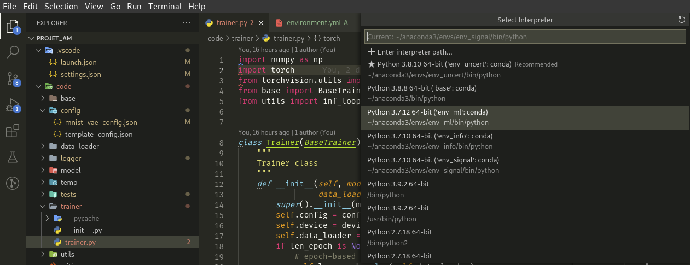
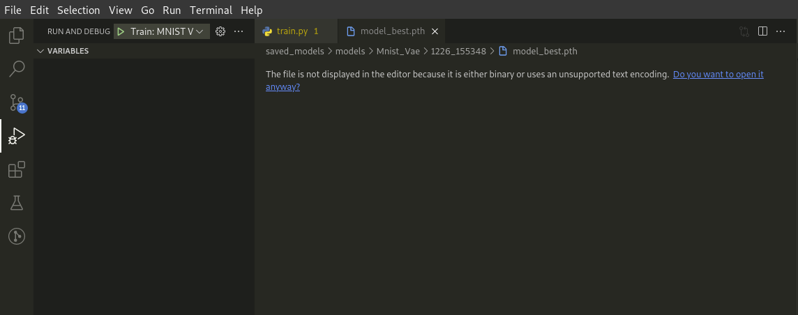
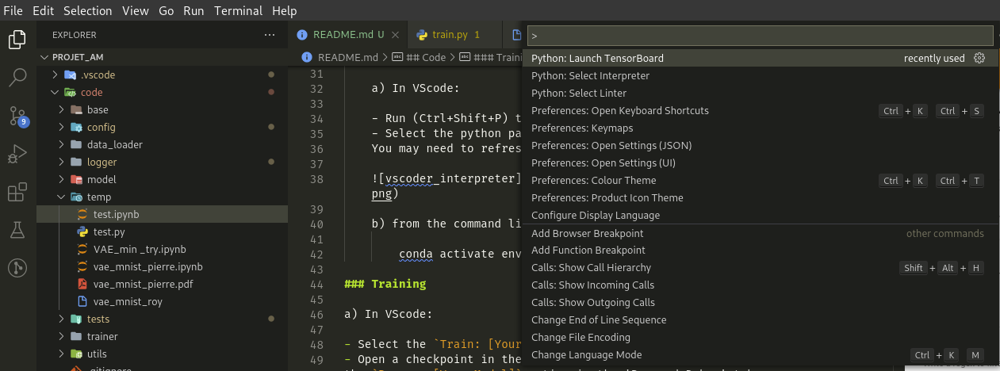

## Audio Network Hacking

---

## Overview

### Models

1) MNIST VAE

    - Config path: `code/config/mnist_vae_config.json`
    - Log directory: `saved_models/log/Mnist_Vae/`
    - Checkpoint directory: `saved_models/models/Mnist_Vae/`

2) Audio VAE 

    __to do__

## Code

### Set-up

1) Create Conda environment if necessary:

        conda env create -f code/environment.yml

    This will create a new Conda environment named `env_ml`.

2) Activate the environment:

    a) In VScode:

    - Run (Ctrl+Shift+P) the `Python: Select Interpreter` command.
    - Select the python path matching `env_ml`.
    You may need to refresh the interpreter list 



    b) from the command line

        conda activate env_ml

### Training

a) In VScode:

- Select the `Train: [Your Model]` option in the 'Run and Debug' tab.
- Open a checkpoint in the checkpoint dir and select 
the `Resume: [Your Model]` option in the 'Run and Debug' tab.




b) From the command line:

```bash
    python3 ./code/train.py --config "path_to_model_config_file.json" [--resume "path_to_model_checkpoint_file.pkl"])
```

#### Using TensorBoard

a) In VScode:

    - Run (Ctrl+Shift+P) the `Python: Launch Tensorflow` command.
    - Select 'Use current working directory'.
    - The TensorBoard watcher should open in a new view. 




b) From the command line:

```bash
    tensorboard --logdir "log_dir"
```

- Then follow the given address in a web browser
(ex: http://localhost:6006).
- Refer to the [Models](###Models) section for information
on logging directories for each model type.

### Testing

a) In VScode:
- Open a checkpoint in the checkpoint directory
- Select the `Test: [Your Model]` option in the 'Run and Debug' tab.


b) From the command line:

```bash
    python3 ./code/test.py --config "path_to_model_config_file.json" --resume "path_to_model_checkpoint_file.pkl")
```

- Refer to the [Models](###Models) section for information
on configuration and checkpoint files for each model type.

## Dataset


__to do__


## References

- [Subject](./doc/atiam2021_Chemla.pdf)
